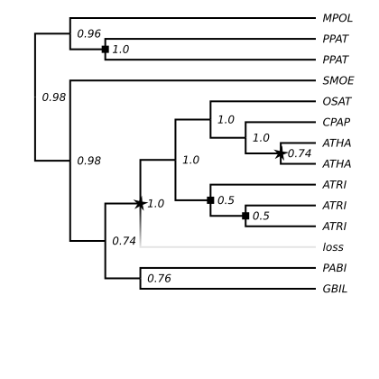

[](https://arzwa.github.io/Whale.jl/dev/index.html)
[](https://travis-ci.com/arzwa/Whale.jl)

# Whale: Bayesian gene tree reconciliation and whole-genome duplication inference by amalgamated likelihood estimation

```julia
#
#                             .-------------'```'----....,,__                        _,
#                            |                               `'`'`'`'-.,.__        .'(
#                            |                                             `'--._.'   )
#                            |                                                   `'-.<
#                            \               .-'`'-.                            -.    `\
#                             \               -.o_.     _                     _,-'`\    |
#                              ``````''--.._.-=-._    .'  \            _,,--'`      `-._(
#                                (^^^^^^^^`___    '-. |    \  __,,..--'                 `
#                                 `````````   `'--..___\    |`
#                                                       `-.,'
```

Whale.jl is a julia library for joint inference of gene tree topologies and their reconciliations to a species tree. Whale uses the **amalgamation** method of Szollosi et al. (2014) to efficiently compute the marginal likelihood of the gene family under a duplication-loss model of gene family evolution over a distribution of tree topologies. Whale also implements a duplication-loss and whole-genome duplication (DLWGD) model (Rabier et al. 2014, Zwaenepoel et al. 2019). The latter can be used for the inference of ancient whole-genome duplications (WGDs) from gene trees while taking into account gene tree and reconciliation uncertainty.

The likelihood routines implemented in Whale support **automatic differentiation** using `ForwardDiff.jl`, allowing for efficient gradient-based Maximum-likelihood estimation and Hamiltonian Monte Carlo (HMC) based Bayesian inference. The library focuses on the Bayesian case, and implements relaxed clock priors to model the evolution of gene duplication and loss rates. Lastly, Whale allows to sample reconciled trees from the posterior distribution or a parameterized DL(+WGD) model using a stochastic backtracking agorithm (as in [ALE](https://github.com/ssolo/ALE)).

Please have a look at the [docs](https://arzwa.github.io/Whale.jl/dev/index.html) for usage instructions and documentation. You might want to get some minimal familiarity with the Julia REPL and its package manager when using Whale, see [the julia docs](https://docs.julialang.org/en/v1/).

Note that the scripts in the `scripts` directory might be helpful to prepare data for Whale analyses.

## Quickstart using Turing and a constant-rates model

```julia
using Whale, NewickTree, Distributions, Turing, DataFrames
```

Get the tree

```julia
t = deepcopy(Whale.extree)
n = length(postwalk(t))  # number of internal nodes
```

```
17
```

Now we add two WGD nodes to the tree. We do this by specifying
the last common ancestor node for the lineages that share the
hypothetical WGD. By default, the added node is halfway between
the specified node and its parent.

```julia
insertnode!(getlca(t, "ATHA", "ATHA"), name="wgd")
insertnode!(getlca(t, "ATHA", "ATRI"), name="wgd")
```

```
0.6125
```

and we obtain a reference model object, here we will use a constant-rates
model

```julia
θ = ConstantDLWGD(λ=0.1, μ=0.2, q=[0.2, 0.1], η=0.9)
r = Whale.RatesModel(θ, fixed=(:p,))
w = WhaleModel(r, t, .1);
```

next we get the data (we need a model object for that)

```julia
ccd = read_ale(joinpath("example/example-1/ale"), w)
```

```
12-element Array{Whale.CCD{UInt16,Float64},1}:
 CCD{UInt16,Float64}(Γ=83, 𝓛=13)
 CCD{UInt16,Float64}(Γ=55, 𝓛=13)
 CCD{UInt16,Float64}(Γ=89, 𝓛=13)
 CCD{UInt16,Float64}(Γ=131, 𝓛=13)
 CCD{UInt16,Float64}(Γ=107, 𝓛=13)
 CCD{UInt16,Float64}(Γ=59, 𝓛=13)
 CCD{UInt16,Float64}(Γ=53, 𝓛=13)
 CCD{UInt16,Float64}(Γ=83, 𝓛=13)
 CCD{UInt16,Float64}(Γ=59, 𝓛=13)
 CCD{UInt16,Float64}(Γ=95, 𝓛=13)
 CCD{UInt16,Float64}(Γ=67, 𝓛=13)
 CCD{UInt16,Float64}(Γ=65, 𝓛=13)
```

Now we define the Turing model

```julia
@model constantrates(model, ccd) = begin
    r  ~ MvLogNormal(ones(2))
    η  ~ Beta(3,1)
    q1 ~ Beta()
    q2 ~ Beta()
    ccd ~ model((λ=r[1], μ=r[2], η=η, q=[q1, q2]))
end

model = constantrates(w, ccd)
chain = sample(model, NUTS(0.65), 100)
pdf = DataFrame(chain)
first(pdf, 5)
```

```
5×5 DataFrame
│ Row │ q1        │ q2       │ r[1]     │ r[2]     │ η        │
│     │ Float64   │ Float64  │ Float64  │ Float64  │ Float64  │
├─────┼───────────┼──────────┼──────────┼──────────┼──────────┤
│ 1   │ 0.0363986 │ 0.180667 │ 0.116364 │ 0.133189 │ 0.8814   │
│ 2   │ 0.0399424 │ 0.621034 │ 0.128347 │ 0.169938 │ 0.814346 │
│ 3   │ 0.128362  │ 0.239903 │ 0.120084 │ 0.139141 │ 0.820706 │
│ 4   │ 0.102919  │ 0.116727 │ 0.107388 │ 0.153163 │ 0.783433 │
│ 5   │ 0.0347364 │ 0.451086 │ 0.140796 │ 0.193334 │ 0.772992 │
```

We can sample reconciled trees from the posterior using a backtracking algorithm

```julia
fun = (m, x)-> Array(x) |> x->m((λ=x[3], μ=x[4], η=x[5], q=x[1:2]))
tt = TreeTracker(w, ccd[end-1:end], pdf, fun)
trees = track(tt)
```

```
2-element Array{Whale.RecSummary,1}:
 RecSummary(# unique trees = 20)
 RecSummary(# unique trees = 21)
```

now we plot the tree using `Luxor.jl`

```julia
using PalmTree, Luxor
import Luxor: RGB

rectree = trees[1].trees[1].tree
outpath = joinpath(@__DIR__, "example/example-1/tree.svg")
tl = TreeLayout(rectree, cladogram=true, dims=(400,500))
gray, blck = RGB(0.99, 0.99, 0.99), RGB()

@svg begin
    Luxor.origin(Point(0,20))
    setfont("Noto sans italic", 7)
    drawtree(tl, color=n->n.data.label != "loss" ? blck : gray)
    nodemap(tl, prewalk(rectree),
        (n, p) -> !isleaf(n) ?
            settext("  $(n.data.cred)", p, valign="center") :
            settext("  $(n.data.name)", p, valign="center"))
    nodemap(tl, prewalk(rectree),
        (n, p) -> n.data.label == "duplication" && box(p, 4, 4, :fill))
end 400 500 outpath;
```



## Citation

If you use Whale, please cite:

>[Zwaenepoel, A. and Van de Peer, Y., 2019. Inference of Ancient Whole-Genome Duplications and the Evolution of Gene Duplication and Loss Rates. *Molecular biology and evolution*, 36(7), pp.1384-1404.](https://academic.oup.com/mbe/article-abstract/36/7/1384/5475503)

---

*This page was generated using [Literate.jl](https://github.com/fredrikekre/Literate.jl).*

