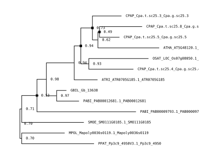

# Manual

Below the major components of the Whale library are discussed.

```@meta
DocTestSetup = quote
    using Whale
end
```

## Sliced species tree

The ALE approach to probabilistic gene tree - species tree reconciliation uses a discretization of the branches of the species tree into small time intervals. This 'sliced' species tree defines the main structure of the model.

```julia
julia> st = Whale.example_tree()
SlicedTree(9, 17, 7)

julia> st.tree
Phylogenetic tree with 24 nodes and 23 branches

julia> st.leaves
Dict{Int64,String} with 9 entries:
  4  => "PPAT"
  13 => "CPAP"
  10 => "OSAT"
  14 => "ATRI"
  3  => "MPOL"
  16 => "GBIL"
  17 => "PABI"
  6  => "SMOE"
  12 => "ATHA"

julia> st[3, 4]  # length of 4th slice in branch 3
0.049499999999999995

julia> nslices(st, 3)  # number of slices in branch 3
97
```

To get a tree in Newick format into a `SlicedTree`, one can simply use
`SlicedTree(tree_file)`.

!!! note
    Note that the tree is assumed to be **ultrametric** and that you might need
    to change the default `Δt` value for your purposes. WGDs can be specified
    by using a configuration dictionary (see [`SlicedTree`](@ref)).

For visualizing tree structures, the [`PalmTree`](https://github.com/arzwa/PalmTree.jl) library can be used. It is often useful for example to plot the tree with internal node labels for specifying models in Whale

```julia
>julia using PalmTree
>julia drawtree(st, nodelabels=true)
```


### Rate indices

The `SlicedTree` structure has two fields that store mappings from
nodes/branches in the tree to indices in hypothetical parameter vectors. The
`qindex` field is a mapping (Dict) from WGD nodes to indiced for a vector of
retention rates, whereas the `rindex` serves as a mapping from species tree
branches to indices for the duplication and loss rate vectors. The default
`rindex` has a different index for each branch of the species tree, and with
the same index for the part of a branch before and after a WGD (note that branches are identified by the index of there downstream (leafward) node).

```julia
julia> st = Whale.example_tree();

julia> st.qindex
Dict{Int64,Int64} with 7 entries:
  20 => 3
  23 => 6
  24 => 7
  19 => 2
  21 => 4
  22 => 5
  18 => 1

julia> st.rindex
Dict{Int64,Int64} with 24 entries:
  18 => 4
  2  => 2
  16 => 16
  11 => 11
  21 => 8
  7  => 7
  9  => 9
  10 => 10
  19 => 13
  17 => 17
  8  => 8
  22 => 7
  6  => 6
  24 => 12
  4  => 4
  3  => 3
  5  => 5
  20 => 12
  23 => 10
  13 => 13
  14 => 14
  15 => 15
  12 => 12
  1  => 1
```

In this example, branches 20, 24 and 12 (which are all part of the same species tree branch but refer to different segments marked by WGD nodes) all point to index 12, which means that they are associated with the same duplication and loss rates.

The `rindex` can be modified to specify arbitrary rate models (for instance fixing a particular clade to a one shared duplication and loss rate). In order to specify a constant-rates model, one can do

```julia
julia> st = Whale.example_tree();

julia> set_constantrates!(st)

julia> st.rindex
Dict{Int64,Int64} with 24 entries:
  18 => 1
  2  => 1
  16 => 1
  11 => 1
  21 => 1
  ...
```

## Conditional clade distribution(s)

The conditional clade distributions (CCDs) for a set of gene families provide the main input data (observations) for Whale analyses. These can be read from `.ale` files generated by [`ALEobserve`](https://github.com/ssolo/ALE). The `read_ale` function accepts either a single `.ale` file, a text file with on each line the path to a `.ale` file or a directory of `.ale` files. When an empty file is provided, a dummy CCD object will be created (which is useful when one wants to run an MCMC chain without data to check the prior specification).

```julia
ccd = read_ale("example-ale/", st)
```

By default, `read_ale` will distribute the resulting CCD array over all available processors.

## The `WhaleModel`

The last object of importance to do inference with `Whale` is the `WhaleModel` type. This structure is used for computing the probability of observing the data conditional on the model and its parameters (`logpdf`).

```julia
julia> st = Whale.example_tree()
SlicedTree(9, 17, 7)

julia> w = WhaleModel(st)
WhaleModel{Float64,CCD}(
λ: [0.2, 0.2, 0.2, 0.2, 0.2, 0.2, 0.2, 0.2, 0.2, 0.2, 0.2, 0.2, 0.2, 0.2, 0.2, 0.2, 0.2]
μ: [0.2, 0.2, 0.2, 0.2, 0.2, 0.2, 0.2, 0.2, 0.2, 0.2, 0.2, 0.2, 0.2, 0.2, 0.2, 0.2, 0.2]
q: [0.2, 0.2, 0.2, 0.2, 0.2, 0.2, 0.2]
η: 0.9
)

julia> logpdf(w, ccd[1])  # single CCD
-33.02373281306193

julia> logpdf(w, ccd)     # multiple CCDs, distributed by default
-295.9876637508207

julia> w = WhaleModel(st, rand(17), rand(17), rand(7), 0.66)  # full constructor
WhaleModel{Float64,CCD}(
λ: [0.607217, 0.198395, 0.768005, 0.832315, 0.0132923, 0.603631, 0.0323633, 0.772991, 0.389835, 0.12631, 0.524784, 0.796175,0.863222, 0.922502, 0.539912, 0.0382815, 0.126632]
μ: [0.505428, 0.656688, 0.989006, 0.302106, 0.547902, 0.453853, 0.364014, 0.365818, 0.448469, 0.0661201, 0.220393, 0.993062,0.124143, 0.308521, 0.703235, 0.0623782, 0.125475]
q: [0.0223519, 0.237335, 0.371299, 0.188785, 0.0400993, 0.663875, 0.804251]
η: 0.66
)

julia> logpdf(w, ccd)
-381.6251112958157
```

An informative description of the model can be printed using `describe`

```julia
julia> describe(w)
Leaves
======
4   → PPAT
13  → CPAP
10  → OSAT
14  → ATRI
3   → MPOL
16  → GBIL
17  → PABI
6   → SMOE
12  → ATHA
Rates (λ, μ)
============
3   | λ, μ = 0.2,0.2    | (3)
4   | λ, μ = 0.2,0.2    | (4)
18  | λ, μ = 0.2,0.2    | (4)
2   | λ, μ = 0.2,0.2    | (4,3)
6   | λ, μ = 0.2,0.2    | (6)
16  | λ, μ = 0.2,0.2    | (16)
17  | λ, μ = 0.2,0.2    | (17)
15  | λ, μ = 0.2,0.2    | (16,17)
13  | λ, μ = 0.2,0.2    | (13)
19  | λ, μ = 0.2,0.2    | (13)
12  | λ, μ = 0.2,0.2    | (12)
24  | λ, μ = 0.2,0.2    | (12)
20  | λ, μ = 0.2,0.2    | (12)
11  | λ, μ = 0.2,0.2    | (13,12)
10  | λ, μ = 0.2,0.2    | (10)
23  | λ, μ = 0.2,0.2    | (10)
9   | λ, μ = 0.2,0.2    | (13,10,12)
14  | λ, μ = 0.2,0.2    | (14)
8   | λ, μ = 0.2,0.2    | (13,10,14,12)
21  | λ, μ = 0.2,0.2    | (13,10,14,12)
7   | λ, μ = 0.2,0.2    | (13,10,14,16,17,12)
22  | λ, μ = 0.2,0.2    | (13,10,14,16,17,12)
5   | λ, μ = 0.2,0.2    | (13,10,14,16,17,6,12)
1   | λ, μ = 0.2,0.2    | (4,13,10,14,3,16,17,6,12)
WGDs (q)
========
20, q = 0.2
23, q = 0.2
24, q = 0.2
19, q = 0.2
21, q = 0.2
22, q = 0.2
18, q = 0.2
Other
=====
   η = 0.9
cond = oib
```

!!! note
    The default initial rate values (~0.2) might not be appropriate for you data set and lead to numerical difficulties. Good initial values depend on the unit of time the branch lengths of the `SlicedTree` are expressed in.

## Maximum likelihood estimation

Maximum likelihood estimation is performed using `Optim.jl` with `ForwardDiff.jl` automatic differentiation. By default the `LBFGS` optimizer is used, but other Optimizers from Optim work as well.

```julia
julia> st = Whale.example_tree()
SlicedTree(9, 17, 7)

julia> set_constantrates!(st)

julia> w = WhaleModel(st, 0.2, 0.3)
WhaleModel{Float64,CCD}(
λ: [0.2]
μ: [0.3]
q: [0.2, 0.2, 0.2, 0.2, 0.2, 0.2, 0.2]
η: 0.9
)

julia> mle(w, ccd)
Fminbox
-------
Initial mu = 0.0038519

Fminbox iteration 1
-------------------
Calling inner optimizer with mu = 0.0038519

(numbers below include barrier contribution)
Iter     Function value   Gradient norm
     0     2.990420e+02     9.056730e+01
    10     2.788972e+02     3.959786e+00
  ... # a lot more
, Results of Optimization Algorithm
 * Algorithm: Fminbox with L-BFGS
 * Starting Point: [0.2,0.3,0.2,0.2,0.2,0.2,0.2,0.2,0.2]
 * Minimizer: [0.08839734901061815,0.15058644779285166, ...]
 * Minimum: 2.787698e+02
 * Iterations: 6
 * Convergence: true
   * |x - x'| ≤ 0.0e+00: true
     |x - x'| = 0.00e+00
   * |f(x) - f(x')| ≤ 0.0e+00 |f(x)|: true
     |f(x) - f(x')| = 0.00e+00 |f(x)|
   * |g(x)| ≤ 1.0e-08: false
     |g(x)| = 1.38e+01
   * Stopped by an increasing objective: true
   * Reached Maximum Number of Iterations: false
 * Objective Calls: 1755
 * Gradient Calls: 1755)
```

## Bayesian inference

Currently, a model-specific MCMC algorithm (adaptive metropolis-within-Gibbs) is used. Specifying arbitrary complex models in `Turing.jl` is possible, but currently does not support distributed likelihood evaluation and is therefore not yet possible for the kinds of problems tackled with Whale. This is a major goal for future developments.

### Independent rates model

```julia
st = Whale.example_tree()
w = WhaleChain(st, IRModel(st))
chain = mcmc!(w, D, 100, show_every=10)
```

### Autocorrelated rates model (Geometric Brownian motion)

```julia
st = Whale.example_tree()
w = WhaleChain(st, GBMModel(st))
chain = mcmc!(w, D, 100, show_every=10)
```

### Fixing `η` and/or `ν`

Below the chain is fixed for the parameter values η=0.9 and ν=0.1.

```julia
st = Whale.example_tree()
w = WhaleChain(st, IRModel(st, 0.1, 0.9))
chain = mcmc!(w, D, 100, :ν, :η, show_every=10)
```

## Backtracking and consensus reconciled trees

To backtrack reconciled trees for a particular CCD from a parameterized `WhaleModel` and compute majority-vote consensus trees one can use the following methods

```julia
julia> x
CCD of 13 (83) taxa (clades) based on 5001 samples

julia> w = WhaleModel(st, 0.2, 0.3)
WhaleModel{Float64,CCD}(
λ: [0.2, 0.2, 0.2, 0.2, 0.2, 0.2, 0.2, 0.2, 0.2, 0.2, 0.2, 0.2, 0.2, 0.2, 0.2, 0.2, 0.2]
μ: [0.3, 0.3, 0.3, 0.3, 0.3, 0.3, 0.3, 0.3, 0.3, 0.3, 0.3, 0.3, 0.3, 0.3, 0.3, 0.3, 0.3]
q: [0.2, 0.2, 0.2, 0.2, 0.2, 0.2, 0.2]
η: 0.9
)

julia> backtrack!(x, w, 100)
CCD of 13 (83) taxa (clades) based on 5001 samples

julia> drawtree(x.rectrs[1)
```


!!! note
    Currently the branch lengths in backtracked trees are not yet meaningful, although they are related to the bracnh lengths in the CCD

Majority vote consensus trees can than be obtained

```julia
julia> contree = consensus(x, st)
Phylogenetic tree with 25 nodes and 24 branches, [...]

julia> drawtree(contree)
```


Reconciled trees are stored in the `rectrs` field of the CCD object. By default, during MCMC, every iteration a tree is sampled from the posterior predictive distribution.

```julia
julia> D = read_ale("example/example-ale/", st)
[ Info:  .. read 12 ALE files
12-element DistributedArrays.DArray{CCD,1,Array{CCD,1}}:
 CCD of 13 (83) taxa (clades) based on 5001 samples
 CCD of 13 (55) taxa (clades) based on 5001 samples
 CCD of 13 (89) taxa (clades) based on 5001 samples
 CCD of 13 (131) taxa (clades) based on 5001 samples
 CCD of 13 (107) taxa (clades) based on 5001 samples
 CCD of 13 (59) taxa (clades) based on 5001 samples
 CCD of 13 (53) taxa (clades) based on 5001 samples
 CCD of 13 (83) taxa (clades) based on 5001 samples
 CCD of 13 (59) taxa (clades) based on 5001 samples
 CCD of 13 (95) taxa (clades) based on 5001 samples
 CCD of 13 (67) taxa (clades) based on 5001 samples
 CCD of 13 (65) taxa (clades) based on 5001 samples

julia> w = WhaleChain(st, IRModel(st, 0.1, 0.9));

julia> chain = mcmc!(w, D, 100, :ν, :η)
[...]

julia> crts = consensus(D, st);
```

(Consensus) reconciled trees can be written both in a newick-like format (where support values `x1-x2` denote the clade support (`x1`) and  reconciliation support (`x2`)) and PhyloRecXML format:

```julia
julia> write(stdout, crts[1])
(((PABI_PAB00009793.1_PAB00009793,((((CPAP_Cpa.t.sc25.3_Cpa.g.sc25.3,((CPAP_Cpa.t.sc25.8_Cpa.g.sc25.8,CPAP_Cpa.t.sc25.5_Cpa.g.sc25.5)0.6086956521739131-0.33043478260869563,ATHA_AT5G48120.1_AT5G48120)0.5391304347826087-0.5043478260869565)0.9217391304347826-0.6173913043478261,(OSAT_LOC_Os07g08050.1_LOC_Os07g08050,CPAP_Cpa.t.sc25.4_Cpa.g.sc25.4)0.9043478260869565-0.9043478260869565)1.0-0.9304347826086956,ATRI_ATR0705G185.1_ATR0705G185)1.0-0.991304347826087,(PABI_PAB00012681.1_PAB00012681,GBIL_Gb_13638)1.0-0.9826086956521739)0.991304347826087-0.991304347826087)1.0-0.33043478260869563,SMOE_SMO111G0185.1_SMO111G0185)1.0-0.991304347826087,(MPOL_Mapoly0036s0119.1_Mapoly0036s0119,PPAT_Pp3c9_4950V3.1_Pp3c9_4950)1.0-1.0);
721

julia> write(stdout, crts[1], st, family=D[1].fname)
<recGeneTree
    xmlns:xsi="http://www.w3.org/2001/XMLSchema-instance"
    xmlns="http://www.recgenetreexml.org"
"txsi:schemaLocation="http://www.recgenetreexml.org ../../xsd/recGeneTreeXML.xsd">
    <phylogeny rooted="true">
        <id>example/example-ale/OG0004512.fasta.nex.treesample.ale</id>
        <clade>
            <name>1</name>
            <eventsRec><speciation speciesLocation="1"></speciation></eventsRec>
            <clade>
                <name>2</name>
                <eventsRec><speciation speciesLocation="5"></speciation></eventsRec>
                <clade>
                    <name>3</name>
                    <eventsRec><duplication speciesLocation="7"></duplication></eventsRec>
                    <clade>
                        <name>PABI_PAB00009793.1_PAB00009793</name>
                        <eventsRec><leaf speciesLocation="PABI" geneName="PABI_PAB00009793.1_PAB00009793"></leaf></eventsRec>
                    </clade>
                    [...]
                    </clade>
               <clade>
                   <name>PPAT_Pp3c9_4950V3.1_Pp3c9_4950</name>
                   <eventsRec><leaf speciesLocation="PPAT" geneName="PPAT_Pp3c9_4950V3.1_Pp3c9_4950"></leaf></eventsRec>
               </clade>
           </clade>
       </clade>
   </phylogeny>
</recGeneTree>29
```
