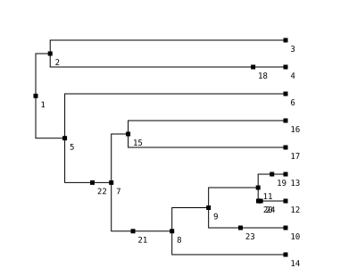
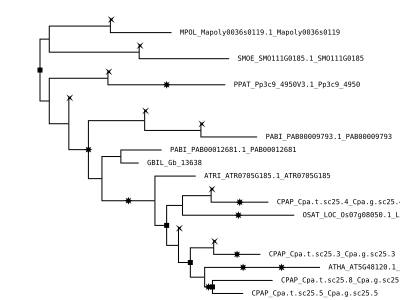
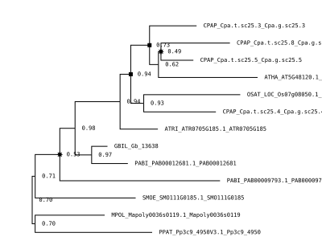

# Manual

Below the major components of the Whale library are discussed.

```@meta
DocTestSetup = quote
    using Whale
    using Random
    Random.seed!(1234)
end
```

## Sliced species tree

The ALE approach to probabilistic gene tree - species tree reconciliation uses a discretization of the branches of the species tree into small time intervals. This 'sliced' species tree defines the main structure of the model.

```jldoctest
julia> st = Whale.example_tree()
SlicedTree(9, 17, 7)

julia> st.tree

Phylogenetic tree with 24 nodes and 23 branches

julia> st.leaves
Dict{Int64,String} with 9 entries:
  4  => "PPAT"
  13 => "CPAP"
  10 => "OSAT"
  14 => "ATRI"
  3  => "MPOL"
  16 => "GBIL"
  17 => "PABI"
  6  => "SMOE"
  12 => "ATHA"

julia> st[3, 4]  # length of 4th slice in branch 3
0.049499999999999995

julia> nslices(st, 3)  # number of slices in branch 3
97
```

To get a tree in Newick format into a `SlicedTree`, one can simply use
`SlicedTree(tree_file)`.

!!! note
    Note that the tree is assumed to be **ultrametric** and that you might need
    to change the default `Δt` value for your purposes. WGDs can be specified
    by using a configuration dictionary (see [`SlicedTree`](@ref)).

For visualizing tree structures, the [`PalmTree`](https://github.com/arzwa/PalmTree.jl) library can be used. It is often useful for example to plot the tree with internal node labels for specifying models in Whale

```julia-repl
julia> using PalmTree
julia> drawtree(st, nodelabels=true)
```

Here, nodes 18 to 24 are WGD 'nodes', marking hypothetical WGDs along the sliced species tree.



### Rate indices

The `SlicedTree` structure has two fields that store mappings from
nodes/branches in the tree to indices in hypothetical parameter vectors. The
`qindex` field is a mapping (Dict) from WGD nodes to indiced for a vector of
retention rates, whereas the `rindex` serves as a mapping from species tree
branches to indices for the duplication and loss rate vectors. The default
`rindex` has a different index for each branch of the species tree, and with
the same index for the part of a branch before and after a WGD (note that branches are identified by the index of there downstream (leafward) node).

```jldoctest
julia> st = Whale.example_tree();

julia> st.qindex
Dict{Int64,Int64} with 7 entries:
  20 => 3
  23 => 6
  24 => 7
  19 => 2
  21 => 4
  22 => 5
  18 => 1

julia> st.rindex
Dict{Int64,Int64} with 24 entries:
  18 => 4
  2  => 2
  16 => 16
  11 => 11
  21 => 8
  7  => 7
  9  => 9
  10 => 10
  19 => 13
  17 => 17
  8  => 8
  22 => 7
  6  => 6
  24 => 12
  4  => 4
  3  => 3
  5  => 5
  20 => 12
  23 => 10
  ⋮  => ⋮
```

In this example, branches 20, 24 and 12 (which are all part of the same species tree branch but refer to different segments marked by WGD nodes) all point to index 12, which means that they are associated with the same duplication and loss rates.

The `rindex` can be modified to specify arbitrary rate models (for instance fixing a particular clade to a one shared duplication and loss rate). In order to specify a consjuliatant-rates model, one can do

```jldoctest
julia> st = Whale.example_tree();

julia> set_constantrates!(st)

julia> st.rindex
Dict{Int64,Int64} with 24 entries:
  18 => 1
  2  => 1
  16 => 1
  11 => 1
  21 => 1
  7  => 1
  9  => 1
  10 => 1
  19 => 1
  17 => 1
  8  => 1
  22 => 1
  6  => 1
  24 => 1
  4  => 1
  3  => 1
  5  => 1
  20 => 1
  23 => 1
  ⋮  => ⋮
```

## Conditional clade distribution(s)

The conditional clade distributions (CCDs) for a set of gene families provide the main input data (observations) for Whale analyses. These can be read from `.ale` files generated by [`ALEobserve`](https://github.com/ssolo/ALE). The `read_ale` function accepts either a single `.ale` file, a text file with on each line the path to a `.ale` file or a directory of `.ale` files. When an empty file is provided, a dummy CCD object will be created (which is useful when one wants to run an MCMC chain without data to check the prior specification).

```jldoctest
julia> st = Whale.example_tree();

julia> ccd = read_ale("../example/example-ale/", st)
[ Info:  .. read 12 ALE files
12-element DistributedArrays.DArray{CCD,1,Array{CCD,1}}:
 CCD{Float64,PhyloTrees.RecTree}(13 taxa, 83 clades, 5001 samples)
 CCD{Float64,PhyloTrees.RecTree}(13 taxa, 55 clades, 5001 samples)
 CCD{Float64,PhyloTrees.RecTree}(13 taxa, 89 clades, 5001 samples)
 CCD{Float64,PhyloTrees.RecTree}(13 taxa, 131 clades, 5001 samples)
 CCD{Float64,PhyloTrees.RecTree}(13 taxa, 107 clades, 5001 samples)
 CCD{Float64,PhyloTrees.RecTree}(13 taxa, 59 clades, 5001 samples)
 CCD{Float64,PhyloTrees.RecTree}(13 taxa, 53 clades, 5001 samples)
 CCD{Float64,PhyloTrees.RecTree}(13 taxa, 83 clades, 5001 samples)
 CCD{Float64,PhyloTrees.RecTree}(13 taxa, 59 clades, 5001 samples)
 CCD{Float64,PhyloTrees.RecTree}(13 taxa, 95 clades, 5001 samples)
 CCD{Float64,PhyloTrees.RecTree}(13 taxa, 67 clades, 5001 samples)
 CCD{Float64,PhyloTrees.RecTree}(13 taxa, 65 clades, 5001 samples)
```

By default, `read_ale` will distribute the resulting CCD array over all available processors.

## The `WhaleModel`

The last object of importance to do inference with `Whale` is the `WhaleModel` type. This structure is used for computing the probability of observing the data conditional on the model and its parameters (`logpdf`).

```jldoctest
julia> st = Whale.example_tree();

julia> ccd = read_ale("../example/example-ale/", st);
[ Info:  .. read 12 ALE files

julia> w = WhaleModel(st)
WhaleModel{Float64,CCD}(
λ: [0.2, 0.2, 0.2, 0.2, 0.2, 0.2, 0.2, 0.2, 0.2, 0.2, 0.2, 0.2, 0.2, 0.2, 0.2, 0.2, 0.2]
μ: [0.3, 0.3, 0.3, 0.3, 0.3, 0.3, 0.3, 0.3, 0.3, 0.3, 0.3, 0.3, 0.3, 0.3, 0.3, 0.3, 0.3]
q: [0.2, 0.2, 0.2, 0.2, 0.2, 0.2, 0.2]
η: 0.9
)

julia> logpdf(w, ccd[1])  # single CCD
-32.70481615232666

julia> logpdf(w, ccd)     # multiple CCDs, distributed by default
-298.98170493684256

julia> w = WhaleModel(st, rand(17), rand(17), rand(7), 0.66)  # full constructor
WhaleModel{Float64,CCD}(
λ: [0.590845, 0.766797, 0.566237, 0.460085, 0.794026, 0.854147, 0.200586, 0.298614, 0.246837, 0.579672, 0.648882, 0.0109059, 0.066423, 0.956753, 0.646691, 0.112486, 0.276021]
μ: [0.651664, 0.0566425, 0.842714, 0.950498, 0.96467, 0.945775, 0.789904, 0.82116, 0.0341601, 0.0945445, 0.314926, 0.12781, 0.374187, 0.931115, 0.438939, 0.246862, 0.0118196]
q: [0.0460428, 0.496169, 0.732, 0.299058, 0.449182, 0.875096, 0.0462887]
η: 0.66
)

julia> logpdf(w, ccd)
-370.067694892539
```

An informative description of the model can be printed using `describe`

```jldoctest
julia> st = Whale.example_tree();

julia> w = WhaleModel(st);

julia> describe(w)
Leaves
======
4 	→ PPAT
13 	→ CPAP
10 	→ OSAT
14 	→ ATRI
3 	→ MPOL
16 	→ GBIL
17 	→ PABI
6 	→ SMOE
12 	→ ATHA
Rates (λ, μ)
============
3 	| λ, μ = 0.2,0.3	| (3)
4 	| λ, μ = 0.2,0.3	| (4)
18 	| λ, μ = 0.2,0.3	| (4)
2 	| λ, μ = 0.2,0.3	| (4,3)
6 	| λ, μ = 0.2,0.3	| (6)
16 	| λ, μ = 0.2,0.3	| (16)
17 	| λ, μ = 0.2,0.3	| (17)
15 	| λ, μ = 0.2,0.3	| (16,17)
13 	| λ, μ = 0.2,0.3	| (13)
19 	| λ, μ = 0.2,0.3	| (13)
12 	| λ, μ = 0.2,0.3	| (12)
24 	| λ, μ = 0.2,0.3	| (12)
20 	| λ, μ = 0.2,0.3	| (12)
11 	| λ, μ = 0.2,0.3	| (13,12)
10 	| λ, μ = 0.2,0.3	| (10)
23 	| λ, μ = 0.2,0.3	| (10)
9 	| λ, μ = 0.2,0.3	| (13,10,12)
14 	| λ, μ = 0.2,0.3	| (14)
8 	| λ, μ = 0.2,0.3	| (13,10,14,12)
21 	| λ, μ = 0.2,0.3	| (13,10,14,12)
7 	| λ, μ = 0.2,0.3	| (13,10,14,16,17,12)
22 	| λ, μ = 0.2,0.3	| (13,10,14,16,17,12)
5 	| λ, μ = 0.2,0.3	| (13,10,14,16,17,6,12)
1 	| λ, μ = 0.2,0.3	| (4,13,10,14,3,16,17,6,12)
WGDs (q)
========
20, q = 0.2
23, q = 0.2
24, q = 0.2
19, q = 0.2
21, q = 0.2
22, q = 0.2
18, q = 0.2
Other
=====
   η = 0.9
cond = oib
```

!!! note
    The default initial rate values (~0.2) might not be appropriate for you data set and lead to numerical difficulties. Good initial values depend on the unit of time the branch lengths of the `SlicedTree` are expressed in.

## Maximum likelihood estimation

Maximum likelihood estimation is performed using `Optim.jl` with `ForwardDiff.jl` automatic differentiation. By default the `LBFGS` optimizer is used, but other Optimizers from Optim work as well.

```julia-repl
julia> st = Whale.example_tree();

julia> set_constantrates!(st)

julia> w = WhaleModel(st, 0.2, 0.3)
WhaleModel{Float64,CCD}(
λ: [0.2]
μ: [0.3]
q: [0.2, 0.2, 0.2, 0.2, 0.2, 0.2, 0.2]
η: 0.9
)

julia> mle(w, ccd)
Fminbox
-------
Initial mu = 0.0038519

Fminbox iteration 1
-------------------
Calling inner optimizer with mu = 0.0038519

(numbers below include barrier contribution)
Iter     Function value   Gradient norm
     0     2.990420e+02     9.056730e+01
    10     2.788972e+02     3.959786e+00
  ... # a lot more
, Results of Optimization Algorithm
 * Algorithm: Fminbox with L-BFGS
 * Starting Point: [0.2,0.3,0.2,0.2,0.2,0.2,0.2,0.2,0.2]
 * Minimizer: [0.08839734901061815,0.15058644779285166, ...]
 * Minimum: 2.787698e+02
 * Iterations: 6
 * Convergence: true
   * |x - x'| ≤ 0.0e+00: true
     |x - x'| = 0.00e+00
   * |f(x) - f(x')| ≤ 0.0e+00 |f(x)|: true
     |f(x) - f(x')| = 0.00e+00 |f(x)|
   * |g(x)| ≤ 1.0e-08: false
     |g(x)| = 1.38e+01
   * Stopped by an increasing objective: true
   * Reached Maximum Number of Iterations: false
 * Objective Calls: 1755
 * Gradient Calls: 1755)
```

## Bayesian inference

Currently, a model-specific MCMC algorithm (following an adaptive metropolis-within-Gibbs scheme) is used. Specifying arbitrary complex models in `Turing.jl` is possible, but currently does not support distributed likelihood evaluation and is therefore not yet possible for the kinds of problems tackled with Whale. This is a major goal for future developments.

### Independent rates model

The default structure of the independent rates model is as follows.

```math
\begin{eqnarray}
\nu &\sim& \mathrm{InverseGamma} \\
\eta &\sim& \mathrm{Beta} \\
\lambda_0 &\sim& \mathrm{Exponential} \\
\mu_0 &\sim& \mathrm{Exponential} \\
\lambda_i &\sim& \mathrm{LogNormal}(\lambda_0, \nu) \\
\mu_i &\sim& \mathrm{LogNormal}(\mu_0, \nu) \\
q_i &\sim& \mathrm{Beta}(1, 1)
\end{eqnarray}
```

But other distributions from the `Distributions.jl` library can be used. It is
also possible to set parameters to fixed values. This is often desirable for
either `η` or `ν` to ensure proper mixing of the chain.

```jldoctest
julia> st = Whale.example_tree()
SlicedTree(9, 17, 7)

julia> w = WhaleChain(st, IRModel(st))
WhaleChain{IRModel}(SlicedTree(9, 17, 7))
```

To run the MCMC simulation, use the `mcmc!` function

```julia-repl
julia> chain = mcmc!(w, D, 100, show_every=10)
```

The resulting `Chains` object is fairly intuitive, see the docs for [`MCMCChains.jl`](https://github.com/TuringLang/MCMCChains.jl).

### Autocorrelated rates model (Geometric Brownian motion)

The default structure is as above but with

```math
\begin{eqnarray}
\nu &\sim& \mathrm{Exponential} \\
\eta &\sim& \mathrm{Beta} \\
\lambda_0 &\sim& \mathrm{Exponential} \\
\mu_0 &\sim& \mathrm{Exponential} \\\lambda_i &\sim& \mathrm{GeometricBrownianMotion}(\lambda_0, \nu) \\
\mu_i &\sim& \mathrm{GeometricBrownianMotion}(\mu_0, \nu) \\
q_i &\sim& \mathrm{Beta}(1, 1)
\end{eqnarray}
```

```julia-repl
julia> st = Whale.example_tree()
julia> w = WhaleChain(st, GBMModel(st))
julia> chain = mcmc!(w, D, 100, show_every=10)
```

### Fixing `η` and/or `ν`

To prevent mixing poor mixing in the MCMC, it is often necessary to fix the `η` and/or `ν` parameters. For `η` this is usually not very problematic, since it embodies already a distributional assumption that allows for uncertainty in prior beliefs (since it is the parameter of the geometric prior distribution  on the number of lineages at the root). Choosing for instance `η = 0.8`, The probability of one lineage at the root is 0.8, two lineages 0.16, three lineages  0.032 etc.

Fixing `ν` (which controls the variation in duplication and loss rates across lineages) can be more troublesome since it is hard to specify a cogent prior. In the context of WGD inference however, the 'true' values of the duplication and loss rates might not matter too much, and we are mostly interested whether allowing more rate variation across the tree alters are posterior beliefs with regard to WGDs. When the goal is WGD inference, it is therefore advisable to run chains for different `ν` values and see whether this alters the posterior distributions for the retention rates. Often when the rates are constrained to be very similar across the tree (small `ν` values), some duplication/loss rate variation is captured by the retention rate, and in this case, for larger `ν` values, a previously significant non-zero retention rate might shift towards zero.

Below the chain is fixed for the parameter values η=0.9 and ν=0.1.

```julia-repl
julia> st = Whale.example_tree()
julia> w = WhaleChain(st, IRModel(st, 0.1, 0.9))
julia> chain = mcmc!(w, D, 100, :ν, :η, show_every=10)
```

### Sampling from the prior

It is generally advisable to run a chain without data, to investigate the prior distributions one has assigned, and validate the correctness of the MCMC algorithm. This can be done as follows:

```julia-repl
julia> st = Whale.example_tree()
julia> w = WhaleChain(st, IRModel(st, InverseGamma(10), 0.9, Exponential(1.), Exponential(1.)))
julia> chain = mcmc!(w, 10000, :η)   # e.g. with fixed η
```

## Backtracking and consensus reconciled trees

To backtrack reconciled trees for a particular CCD from a parameterized `WhaleModel` and compute majority-vote consensus trees one can use the following methods

```julia-repl
julia> x  # a single CCD
CCD{Float64,PhyloTrees.RecTree}(13 taxa, 83 clades, 5001 samples)

julia> w = WhaleModel(st, 0.2, 0.3)
WhaleModel{Float64,CCD}(
λ: [0.2, 0.2, 0.2, 0.2, 0.2, 0.2, 0.2, 0.2, 0.2, 0.2, 0.2, 0.2, 0.2, 0.2, 0.2, 0.2, 0.2]
μ: [0.3, 0.3, 0.3, 0.3, 0.3, 0.3, 0.3, 0.3, 0.3, 0.3, 0.3, 0.3, 0.3, 0.3, 0.3, 0.3, 0.3]
q: [0.2, 0.2, 0.2, 0.2, 0.2, 0.2, 0.2]
η: 0.9
)

julia> backtrack!(x, w, 100)
CCD{Float64,PhyloTrees.RecTree}(13 taxa, 83 clades, 5001 samples)

julia> drawtree(x.rectrs[1)
```



!!! note
    Currently the branch lengths in backtracked trees are not yet meaningful, although they are related to the branch lengths in the CCD.

Majority vote consensus trees can than be obtained

```julia-repl
julia> contree = consensus(x, st)
Phylogenetic tree with 25 nodes and 24 branches, [...]

julia> drawtree(contree)
```


Reconciled trees are stored in the `rectrs` field of the CCD object. By default, during MCMC, every iteration a tree is sampled from the posterior predictive distribution.

```julia-repl
julia> D = read_ale("example/example-ale/", st);
[ Info:  .. read 12 ALE files

julia> w = WhaleChain(st, IRModel(st, 0.1, 0.9));

julia> chain = mcmc!(w, D, 100, :ν, :η);

julia> crts = consensus(D, st);
```

(Consensus) reconciled trees can be written in a newick-like format, where support values `x1-x2` with `x1` the clade support, which is the frequency by which the clade was observed in the sample of reconciled trees, and `x2` the reconciliation support, being the frequency of this nodes majority vote reconciliation (e.g. duplication or speciation). Note that loss events do not appear in consensus reconciliations (but they can be easily determined based on the reconciliations of other nodes).

```julia
julia> write(stdout, crts[1])
(((PABI_PAB00009793.1_PAB00009793,((((CPAP_Cpa.t.sc25.3_Cpa.g.sc25.3,((CPAP_Cpa.t.sc25.8_Cpa.g.sc25.8,CPAP_Cpa.t.sc25.5_Cpa.g.sc25.5)0.6086956521739131-0.33043478260869563,ATHA_AT5G48120.1_AT5G48120)0.5391304347826087-0.5043478260869565)0.9217391304347826-0.6173913043478261,(OSAT_LOC_Os07g08050.1_LOC_Os07g08050,CPAP_Cpa.t.sc25.4_Cpa.g.sc25.4)0.9043478260869565-0.9043478260869565)1.0-0.9304347826086956,ATRI_ATR0705G185.1_ATR0705G185)1.0-0.991304347826087,(PABI_PAB00012681.1_PAB00012681,GBIL_Gb_13638)1.0-0.9826086956521739)0.991304347826087-0.991304347826087)1.0-0.33043478260869563,SMOE_SMO111G0185.1_SMO111G0185)1.0-0.991304347826087,(MPOL_Mapoly0036s0119.1_Mapoly0036s0119,PPAT_Pp3c9_4950V3.1_Pp3c9_4950)1.0-1.0);
```

(Consensus) reconciled trees can also be written in [PhyloRecXML](http://phylariane.univ-lyon1.fr/recphyloxml/) format:

```
julia> write(stdout, crts[1], st, family=D[1].fname)
<recGeneTree
    xmlns:xsi="http://www.w3.org/2001/XMLSchema-instance"
    xmlns="http://www.recgenetreexml.org" "txsi:schemaLocation="http://www.recgenetreexml.org ../../xsd/recGeneTreeXML.xsd">
    <phylogeny rooted="true">
        <id>example/example-ale/OG0004512.fasta.nex.treesample.ale</id>
        <clade>
            <name>1</name>
            <eventsRec><speciation speciesLocation="1"></speciation></eventsRec>
            <clade>
                <name>2</name>
                <eventsRec><speciation speciesLocation="5"></speciation></eventsRec>
                <clade>
                    <name>3</name>
                    <eventsRec><duplication speciesLocation="7"></duplication></eventsRec>
                    <clade>
                        <name>PABI_PAB00009793.1_PAB00009793</name>
                        <eventsRec><leaf speciesLocation="PABI" geneName="PABI_PAB00009793.1_PAB00009793"></leaf></eventsRec>
                    </clade>
                    [...]  # a lot more
                    </clade>
               <clade>
                   <name>PPAT_Pp3c9_4950V3.1_Pp3c9_4950</name>
                   <eventsRec><leaf speciesLocation="PPAT" geneName="PPAT_Pp3c9_4950V3.1_Pp3c9_4950"></leaf></eventsRec>
               </clade>
           </clade>
       </clade>
   </phylogeny>
</recGeneTree>
```
